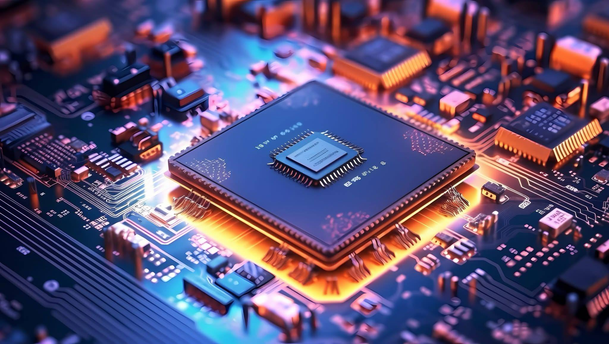

<!-- GitHub Profile -->

<!--  -->

<!--![Header] (./profileHeader.png) -->

<h1 align="center">Hi there 👋, I'm Tran Minh Hoang</h1>
<h3 align="center">An Embedded Software Developer from Vietnam 🇻🇳</h3>

  🔧 Passionate about Embedded 
  ⚙️ Experienced with microcontrollers like STM32, ESP32, ESP8266, 8051, AVR, Arduino, Raspberry Pi, BeagleBone Black, Cortex-ARM,..  
  📡 Interested in IoT, real-time systems, and hardware design, coding, testing,..

---
### 🧑‍💻 About Me

- 🎓 Graduated in Electronics and Telecommunication
- 👨‍💻 Embedded Software Engineer with hands-on experience in real projects
- 🧠 Strong in C/C++, Bare-metal programming, and FreeRTOS
- 📡 Skilled in working with communication protocols: UART, SPI, I2C, LoRa, MQTT...
- 🛠️ Familiar with debugging tools, oscilloscopes, and logic analyzers

---

 

  <h1 style="font-size: 1.8rem; color: #2D88FF; margin-bottom: 10px;"><strong>My Skills</strong></h1>

 <h2>Programming Languages</h2>

  
<h2>Embedded Tools & Frameworks</h2>

  
<h2 align="center">Hardware Skills</h2>

   
<h2>General Skills</h2>

 

<h3 align="center">A passionate Embedded developer</h3>
<h4 align="center">🔥 My GitHub Contribution 3D Chart</h4>

  

________________________________________________________

  <strong>Thanks for visiting</strong>
   
  

 

